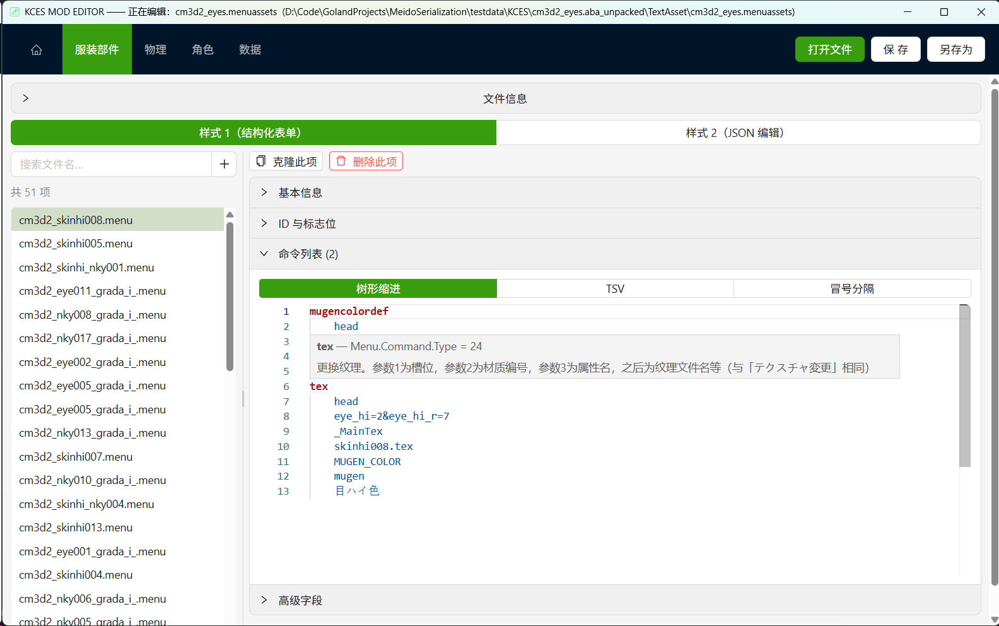
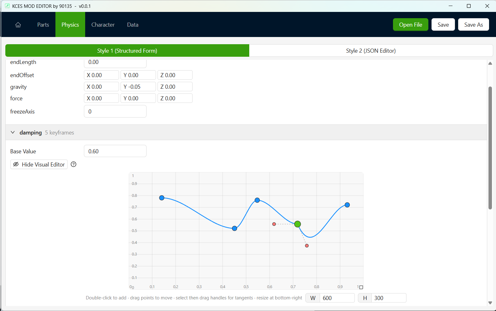
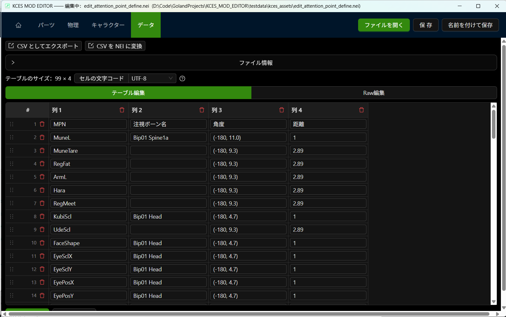
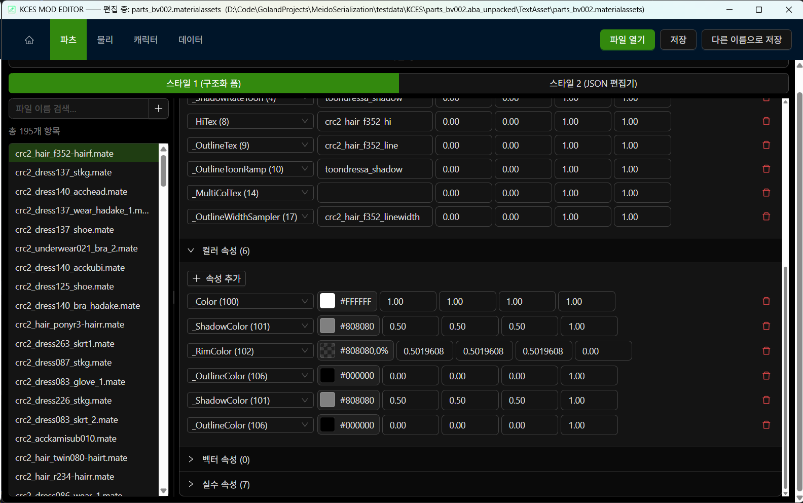

[English](#english) | [简体中文](#%E7%AE%80%E4%BD%93%E4%B8%AD%E6%96%87) | [日本語](#%E6%97%A5%E6%9C%AC%E8%AA%9E)

[Disclaimer/How to Dev/Credit/KISS Rule](#how-to-dev)

[]() [](https://deepwiki.com/MeidoPromotionAssociation/KCES_MOD_EDITOR)

# English

## KCES MOD EDITOR

KCES MOD EDITOR, built with Golang + Wails v3 + React + TypeScript, Modern technology here we come!!

<br>

This is a MOD creation tool (modding tool) for [KCES](https://kces.jp/) (KissCharacter EditSystem) and KCES2

Create a mod for KCES2 that can be used in [COM3D2.5](https://com3d2.jp/) and [CRC3D3](https://crc3d3.jp/).

[KISS](https://www.kisskiss.tv/) is the company/brand that makes these games.

<br>

If you like it, please light up the Star~

Any Bug or request, please use Issues or Discussions

Or you can find me in Discord [Custom Maid Server](https://discord.gg/custommaid)

### Supported File Types

Current Game Version KCES 1.34.5 and KCES2 1.36.0

| Extension                                                          | Description                           | Version Support | Note                                             |
|--------------------------------------------------------------------|---------------------------------------|-----------------|--------------------------------------------------|
| `.menuassets`                                                      | Menu Bundle                           | All versions    |                                                  |
| `.materialassets`                                                  | Material Bundle                       | All versions    |                                                  |
| `.pmatassets`                                                      | Rendering order Bundle                | All versions    |                                                  |
| `.model`                                                           | Model file                            | All versions    | Not including mesh                               |
| `.dbconf` `.db2conf` `.dsbconf` `.dsb2conf` `.dslconf` `.dsl2conf` | Physical parameter configuration file | All versions    |                                                  |
| `.dslcol` `.dbcol`                                                 | Collider parameter configuration file | All versions    |                                                  |
| `.preset`                                                          | Character preset file                 | All versions    |                                                  |
| `.undressdat` `.undresspdat`                                       | Half-undressed data                   | All versions    |                                                  |
| `.nson`                                                            | JSON file                             | All versions    |                                                  |
| `.nei`                                                             | Encryption CSV file                   | All versions    | COM3D2 use Shift-Jis Encoding and KCES use UTF-8 |

Each file corresponds to a .go
file：[https://github.com/MeidoPromotionAssociation/MeidoSerialization/tree/main/serialization/KCES](https://github.com/MeidoPromotionAssociation/MeidoSerialization/tree/main/serialization/KCES)

If you're looking for a serialization library, check
out [https://github.com/MeidoPromotionAssociation/MeidoSerialization](https://github.com/MeidoPromotionAssociation/MeidoSerialization)
That is the core of KCES MOD EDITOR.

### Highlights

- Fully open source, completely free, and completely free; say goodbye to non-open source non-free software.
- With full multilingual support, if you want to add languages, please contribute to us through Issues or Pull Request.
- Ability to create files from scratch, no need to copy files from elsewhere.
- With light mode and dark mode.
- All-in-one.
- More benefits are waiting for you to discover.

### Requirements

This application requires the following software to run:

- Microsoft Edge WebView2
    - This app is built using the Wails framework which relies on Microsoft Edge WebView2 to render the UI.
    - If you're using Windows 11, this is usually pre-installed on your system.
    - For other systems without WebView2 installed，the application should prompt you to install it upon launch.
    - Alternatively, you can install it from the official
      website: [https://developer.microsoft.com/en-us/microsoft-edge/webview2/](https://developer.microsoft.com/en-us/microsoft-edge/webview2/)
    - What is Microsoft Edge
      WebView2? [https://learn.microsoft.com/en-us/microsoft-edge/webview2/](https://learn.microsoft.com/en-us/microsoft-edge/webview2/)
- ImageMagick
    - Required for working with .tex files and image processing features to support various image formats. Optional if
      you don't need .tex editing.
    - Install from the official
      website: [https://imagemagick.org/download](https://imagemagick.org/download)
    - On the download page, look for `ImageMagick-version-Q16-HDRI-x64-dll.exe` and install it. During installation,
      check `Add application directory to your system path`.
    - Or install via terminal command: `winget install ImageMagick.Q16-HDRI`
    - The version used for testing is `ImageMagick-7.1.2-30-Q16-HDRI-x64-dll.exe` If you have problems, please try this
      version.
    - After installation, verify by running `magick -version` in your terminal. A version number output indicates
      success.
    - ImageMagick® is a free and open-source software suite for image editing and manipulation.

### URL Protocol

Other tools can ask KCES MOD EDITOR to open a file through a custom URL scheme:

```
kces-mod-editor://open?path=<URL-encoded absolute path>
```

For example, `D:\mods\example.menuassets` becomes:

```
kces-mod-editor://open?path=D%3A%5Cmods%5Cexample.menuassets
```

- The scheme is registered when the editor is installed: by the Windows installer, or by the `.deb` / `.rpm` package on
  Linux. A portable executable registers nothing, so the protocol is unavailable unless you install the editor.
- `path` must be a URL-encoded absolute path pointing at a file that exists, and its extension must be one this editor
  actually has an editor page for. A request that fails any of these checks is ignored: a protocol URL can be triggered
  by any program or even by a web page, so without an allow list this would amount to "open and display any local file".
- If the editor is already running, the request is handed over to that window and the window is brought to the front
  instead of a second process being started. This is the `Run as a single instance` option on the Settings page. It is
  off by default, so every invocation opens a new window; changing it takes effect on the next launch.
- That option has to be known before the UI exists, so it lives in a settings file instead of browser storage:
  `%AppData%\KCES_MOD_EDITOR\settings.json` on Windows and `~/.config/KCES_MOD_EDITOR/settings.json` on Linux. The
  Settings page shows the exact path.
- Dropping a file onto the window and double-clicking an associated file go through the same open path, so all three
  ways of opening a file behave identically.

### Privacy

This application does not collect any personal information nor upload any data to servers.

The only active network request is for update checks, which solely communicates with GitHub API. You can disable the update check feature.

### Download

By downloading this software, you accept and agree to abide by
the [Disclaimer](https://github.com/MeidoPromotionAssociation/KCES_MOD_EDITOR?tab=readme-ov-file#disclaimer)

Please download it from Github
Releases: [https://github.com/MeidoPromotionAssociation/KCES_MOD_EDITOR/releases](https://github.com/MeidoPromotionAssociation/KCES_MOD_EDITOR/releases)

- If you want to install the editor into your system and automatically associate the file type, please use`kces-mod-editor-amd64-installer.exe `
    - After associating the file type, different files will be displayed with different icons. Please
      check [here](https://github.com/MeidoPromotionAssociation/KCES_MOD_EDITOR/tree/main/build) to preview the icon
- If you don't want to install, please use `kces-mod-editor.exe `
- If you are on Linux, please use `kces-mod-editor_linux_amd64 `

### FAQ

- I want to process files in batches
    - Please use [MeidoSerialization](https://github.com/MeidoPromotionAssociation/MeidoSerialization)

- I want to export to a plain text file
    - It can support importing and exporting to text files, for batch editing or using other editors.
    - Using the Save As function, you can specify the extension as `*.menuassets.json`, `*.materialassets.json`, etc., and you can see
      the prompt when exporting.
    - [MeidoSerialization](https://github.com/MeidoPromotionAssociation/MeidoSerialization) can also support this format.

- About CSV format
    - All CSV files used in this program are encoded using UTF-8-BOM, separated by ',', and follow the [RFC4180](https://datatracker.ietf.org/doc/html/rfc4180)  standard.

<br>

### Also check out other repositories

- [COM3D2 MOD Editor](https://github.com/MeidoPromotionAssociation/COM3D2_MOD_EDITOR)
- [KCES MOD EDITOR](https://github.com/MeidoPromotionAssociation/KCES_MOD_EDITOR)
- [ABA EXPLORER](https://github.com/MeidoPromotionAssociation/ABA_EXPLORER)
- [MeidoSerialization](https://github.com/MeidoPromotionAssociation/MeidoSerialization)
- [COM3D2 Simple Chinese MOD Tutorial](https://github.com/MeidoPromotionAssociation/COM3D2_Simple_MOD_Guide_Chinese)
- [Another COM3D2 Translation Plugin JAT](https://github.com/MeidoPromotionAssociation/COM3D2.JustAnotherTranslator.Plugin)
- [90135's COM3D2 Chinese Guide](https://github.com/90135/COM3D2_GUIDE_CHINESE)
- [90135's COM3D2 Script Collection](https://github.com/90135/COM3D2_Scripts_901)
- [90135's COM3D2 Tools](https://github.com/90135/COM3D2_Tools_901)

<br>

| ScreenShot                | ScreenShot                | ScreenShot                | ScreenShot                |
|---------------------------|---------------------------|---------------------------|---------------------------|
|  |  |  |  |

<br>
<br>
<br>

---

<br>
<br>
<br>

# 简体中文

## KCES MOD EDITOR

KCES MOD 编辑器，使用 Golang + Wails v3 + React + TypeScript 打造，现代技术我们来了！！

<br>

这是用于 [KCES](https://kces.jp/)（KissCharacter EditSystem）与 KCES2 的 MOD 制作工具（modding tool）

您可以为 KCES2 制作 MOD，并在 [COM3D2.5](https://com3d2.jp/) 与 [CRC3D3](https://crc3d3.jp/) 中使用。

[KISS](https://www.kisskiss.tv/) 是制作这些游戏的公司/品牌。

<br>

如果您喜欢，请点亮 Star~

任何 Bug 或请求，请使用 Issues 或 Discussions

你也可以在 Discord [Custom Maid Server](https://discord.gg/custommaid) 找到我

### 支持的文件类型

当前游戏版本 KCES 1.34.5 与 KCES2 1.36.0

| 扩展名                                                             | 描述               | 版本支持 | 备注                                        |
|--------------------------------------------------------------------|--------------------|----------|---------------------------------------------|
| `.menuassets`                                                      | 菜单资源包         | 所有版本 |                                             |
| `.materialassets`                                                  | 材质资源包         | 所有版本 |                                             |
| `.pmatassets`                                                      | 渲染顺序资源包     | 所有版本 |                                             |
| `.model`                                                           | 模型文件           | 所有版本 | 不包含网格数据                              |
| `.dbconf` `.db2conf` `.dsbconf` `.dsb2conf` `.dslconf` `.dsl2conf` | 物理参数配置文件   | 所有版本 |                                             |
| `.dslcol` `.dbcol`                                                 | 碰撞体参数配置文件 | 所有版本 |                                             |
| `.preset`                                                          | 角色预设文件       | 所有版本 |                                             |
| `.undressdat` `.undresspdat`                                       | 半脱衣数据         | 所有版本 |                                             |
| `.nson`                                                            | JSON 文件          | 所有版本 |                                             |
| `.nei`                                                             | 加密 CSV 文件      | 所有版本 | COM3D2 使用 Shift-JIS 编码，KCES 使用 UTF-8 |

每种文件对应一个 .go
文件：[https://github.com/MeidoPromotionAssociation/MeidoSerialization/tree/main/serialization/KCES](https://github.com/MeidoPromotionAssociation/MeidoSerialization/tree/main/serialization/KCES)

如果您正在寻找序列化库，请查看 [https://github.com/MeidoPromotionAssociation/MeidoSerialization](https://github.com/MeidoPromotionAssociation/MeidoSerialization)
这是 KCES MOD EDITOR 的核心。

### 亮点

- 完全开源，完全免费，完全自由；和非开源的非自由软件说再见。
- 拥有完整的多国语言支持，如果您想添加语言，请通过 Issues 或 Pull Request 为我们贡献。
- 有能力从 0 创建文件，告别需要从别处复制文件。
- 拥有浅色模式和暗黑模式。
- 多合一。
- 更多好处等你来发现。

### 依赖

该应用需要以下软件以运行：

- Microsoft Edge WebView2
    - 本应用使用 Wails 技术打造，它依赖于 Microsoft Edge WebView2 来渲染页面，因此需要安装 WebView2。
    - 如果你使用 Windows 11，这通常已经安装在你的系统上了。
    - 如果你使用其他系统，且没有安装 WebView2，启动应用程序时它应该会提示您安装。
      或者您也可以从官方网站安装：[https://developer.microsoft.com/zh-cn/microsoft-edge/webview2](https://developer.microsoft.com/zh-cn/microsoft-edge/webview2)
    - Microsoft Edge WebView2
      是什么？[https://learn.microsoft.com/zh-cn/microsoft-edge/webview2/](https://learn.microsoft.com/zh-cn/microsoft-edge/webview2/)
- ImageMagick
    - 使用 .tex 格式和图片处理相关功能需要安装 ImageMagick，这是为了支持尽可能多的图片格式。如果您不使用 .tex 编辑，您可以选择不安装。
    - 请从官方网站安装：[https://imagemagick.org/download](https://imagemagick.org/download)
    - 在下载页面上找到 `ImageMagick-版本号-Q16-HDRI-x64-dll.exe` 下载并安装，安装时需要勾选
      `Add application directory to your system path`
    - 或者在您的终端执行 `winget install ImageMagick.Q16-HDRI` 命令安装。
    - 用于测试的版本是 `ImageMagick-7.1.2-30-Q16-HDRI-x64-dll.exe` 如果出现问题，请尝试这个版本。
    - 安装完成后在终端执行 `magick -version` 命令查看版本号，如果显示版本号则说明安装成功。
    - ImageMagick® 是一个自由的开源软件套件，用于编辑和操纵数字图像。

### URL 协议

其他工具可以通过自定义 URL scheme 请求 KCES MOD EDITOR 打开文件：

```
kces-mod-editor://open?path=<URL 编码的绝对路径>
```

例如 `D:\mods\example.menuassets` 对应：

```
kces-mod-editor://open?path=D%3A%5Cmods%5Cexample.menuassets
```

- 该 scheme 在安装编辑器时注册：Windows 由安装器注册，Linux 由 `.deb` / `.rpm` 包注册。免安装版不注册任何东西，因此不安装编辑器就无法使用协议。
- `path` 必须是 URL 编码后的绝对路径，且指向一个真实存在的文件，其扩展名必须是本编辑器确实有编辑页面的格式。
  任何一项不满足的请求都会被忽略：协议 URL 可以由任意程序甚至网页触发，没有白名单就等于把「打开并显示任意本地文件」暴露出去。
- 编辑器已经在运行时，请求会转交给那个窗口并把窗口带到前台，而不是再启动一个进程。这就是设置页里的「单实例运行」选项。
  它默认关闭，因此每次唤起都会开一个新窗口；修改后需要重启才生效。
- 这个选项必须在界面出现之前就被读到，所以它存在配置文件里而不是浏览器存储里：Windows 位于
  `%AppData%\KCES_MOD_EDITOR\settings.json`，Linux 位于 `~/.config/KCES_MOD_EDITOR/settings.json`。设置页会显示完整路径。
- 把文件拖到窗口上、双击已关联的文件走的是同一条打开逻辑，因此三种打开方式行为一致。

### 隐私

本应用不会收集任何个人信息，也不会上传任何信息到任何服务器。

唯一的主动网络请求是用于检查更新，它只会请求 GitHub API，您也可以关闭更新检查功能。

### 下载

下载此软件即表示您接受并同意遵守[免责声明](https://github.com/MeidoPromotionAssociation/KCES_MOD_EDITOR?tab=readme-ov-file#disclaimer)

请在 Github Releases
中下载：[https://github.com/MeidoPromotionAssociation/KCES_MOD_EDITOR/releases](https://github.com/MeidoPromotionAssociation/KCES_MOD_EDITOR/releases)

- 如果您希望将编辑器安装到系统中并自动关联文件类型，请使用 `kces-mod-editor-amd64-installer.exe`
    - 关联文件类型后，不同的文件将显示不同的图标。请查看[此处](https://github.com/MeidoPromotionAssociation/KCES_MOD_EDITOR/tree/main/build)预览图标
- 如果您不想安装，请使用 `kces-mod-editor.exe`
- 如果您使用的是 Linux 系统，请使用 `kces-mod-editor_linux_amd64`

### 常见问题

- 我希望批量处理文件
    - 请使用 [MeidoSerialization](https://github.com/MeidoPromotionAssociation/MeidoSerialization)

- 我希望导出为纯文本文件
    - 可以支持导入和导出为文本文件，以便进行批量编辑或使用其他编辑器。
    - 使用另存为功能，可以指定扩展名为 `*.menuassets.json`、`*.materialassets.json` 等，导出时可以看到提示。
    - [MeidoSerialization](https://github.com/MeidoPromotionAssociation/MeidoSerialization) 也支持这种格式。

- 关于 CSV 格式
    - 本程序中使用的所有 CSV 文件均采用 UTF-8-BOM 编码，以 `,` 分隔，并遵循 [RFC4180](https://datatracker.ietf.org/doc/html/rfc4180) 标准。

<br>

### 也可以看看其他仓库

- [COM3D2 MOD 编辑器](https://github.com/MeidoPromotionAssociation/COM3D2_MOD_EDITOR)
- [KCES MOD 编辑器](https://github.com/MeidoPromotionAssociation/KCES_MOD_EDITOR)
- [ABA 浏览器](https://github.com/MeidoPromotionAssociation/ABA_EXPLORER)
- [MeidoSerialization](https://github.com/MeidoPromotionAssociation/MeidoSerialization)
- [COM3D2 简明中文 MOD 教程](https://github.com/MeidoPromotionAssociation/COM3D2_Simple_MOD_Guide_Chinese)
- [另一个 COM3D2 翻译插件 JAT](https://github.com/MeidoPromotionAssociation/COM3D2.JustAnotherTranslator.Plugin)
- [90135 的 COM3D2 中文指北](https://github.com/90135/COM3D2_GUIDE_CHINESE)
- [90135 的 COM3D2 脚本收藏集](https://github.com/90135/COM3D2_Scripts_901)
- [90135 的 COM3D2 工具](https://github.com/90135/COM3D2_Tools_901)

<br>

| 截图                      | 截图                      | 截图                      | 截图                      |
|---------------------------|---------------------------|---------------------------|---------------------------|
|  |  |  |  |

<br>
<br>
<br>

---

<br>
<br>
<br>

# 日本語

## KCES MOD EDITOR

AI Translation

KCES MOD エディターは、Golang + Wails v3 + React + TypeScript を使用して開発されました。最新技術で新たな時代へ！！

<br>

[KCES](https://kces.jp/)（KissCharacter EditSystem）および KCES2 用の MOD 作成ツール（modding tool）です。

KCES2 向けに作成した MOD は、[COM3D2.5](https://com3d2.jp/) と [CRC3D3](https://crc3d3.jp/) で使用できます。

[KISS](https://www.kisskiss.tv/) はこれらのゲームを制作する会社/ブランドです。

<br>

気に入っていただけたら「Star」ボタンを点灯してくださいね〜

バグやリクエストがある場合は、Issues または Discussions をご利用ください

または、Discord [Custom Maid Server](https://discord.gg/custommaid) で私を見つけることができます。

### 対応ファイル形式

対応ゲームバージョン KCES 1.34.5 および KCES2 1.36.0

| 拡張子                                                             | 説明                             | 対応バージョン | 備考                                            |
|--------------------------------------------------------------------|----------------------------------|----------------|-------------------------------------------------|
| `.menuassets`                                                      | メニューアセット                 | 全バージョン   |                                                 |
| `.materialassets`                                                  | マテリアルアセット               | 全バージョン   |                                                 |
| `.pmatassets`                                                      | 描画順アセット                   | 全バージョン   |                                                 |
| `.model`                                                           | モデルファイル                   | 全バージョン   | メッシュは含みません                            |
| `.dbconf` `.db2conf` `.dsbconf` `.dsb2conf` `.dslconf` `.dsl2conf` | 物理パラメータ設定ファイル       | 全バージョン   |                                                 |
| `.dslcol` `.dbcol`                                                 | コライダーパラメータ設定ファイル | 全バージョン   |                                                 |
| `.preset`                                                          | キャラクタープリセットファイル   | 全バージョン   |                                                 |
| `.undressdat` `.undresspdat`                                       | 半脱ぎデータ                     | 全バージョン   |                                                 |
| `.nson`                                                            | JSON ファイル                    | 全バージョン   |                                                 |
| `.nei`                                                             | 暗号化 CSV ファイル              | 全バージョン   | COM3D2 は Shift-JIS、KCES は UTF-8 を使用します |

各ファイルに対応する .go
ファイル：[https://github.com/MeidoPromotionAssociation/MeidoSerialization/tree/main/serialization/KCES](https://github.com/MeidoPromotionAssociation/MeidoSerialization/tree/main/serialization/KCES)

シリアル化ライブラリをお探しの場合は、[https://github.com/MeidoPromotionAssociation/MeidoSerialization](https://github.com/MeidoPromotionAssociation/MeidoSerialization)
をご覧ください。これが KCES MOD EDITOR の核となります。

### ハイライト

- 完全にオープンソース、完全に無料、そして完全にフリー。オープンソースではない、フリーではないソフトウェアとはお別れです。
- 完全な多言語サポートを備えています。言語を追加したい場合は、Issues または Pull Request でご協力ください。
- 最初からファイルを作成する機能。他の場所からファイルをコピーする必要はありません。
- ライトモードとダークモードがあります。
- オールインワン。
- さらに多くのメリットがあなたを待っています。

### 必要なソフトウェア

本アプリケーションの実行には以下のソフトウェアが必要です：

- Microsoft Edge WebView2
    - 本アプリはWailsフレームワークを使用しており、UIのレンダリングにMicrosoft Edge WebView2を必要とします
    - Windows 11をご利用の場合、通常はプリインストールされています
    - 他のOSを使用している場合、WebView2が未インストールの状態でアプリを起動するとインストールプロンプトが表示されます
    - 公式サイトから手動でインストールすることも可能です：[https://developer.microsoft.com/ja-jp/microsoft-edge/webview2/](https://developer.microsoft.com/ja-jp/microsoft-edge/webview2/)
    - Microsoft Edge
      WebView2とは？[https://learn.microsoft.com/ja-jp/microsoft-edge/webview2/](https://learn.microsoft.com/ja-jp/microsoft-edge/webview2/)
- ImageMagick
    - .texファイルの編集および画像処理機能を使用する場合に必要です。.tex編集が不要な場合はインストール不要です
    - 公式サイトからインストールしてください：[https://imagemagick.org/download](https://imagemagick.org/download)
    - ダウンロードページで`ImageMagick-バージョン-Q16-HDRI-x64-dll.exe`を選択し、インストール時に
      `Add application directory to your system path（システムパスに追加）`にチェックを入れてください
    - またはターミナルで次のコマンドを実行：`winget install ImageMagick.Q16-HDRI`
    - テストに使用したバージョンは `ImageMagick-7.1.2-30-Q16-HDRI-x64-dll.exe` です。問題がある場合は、このバージョンを試してください。
    - インストール後、ターミナルで`magick -version`を実行し、バージョン番号が表示されれば成功です
    - ImageMagick® は画像編集・加工用のオープンソースソフトウェアスイートです

### URL プロトコル

他のツールから、カスタム URL スキームで KCES MOD EDITOR にファイルを開かせることができます：

```
kces-mod-editor://open?path=<URL エンコードされた絶対パス>
```

例えば `D:\mods\example.menuassets` の場合：

```
kces-mod-editor://open?path=D%3A%5Cmods%5Cexample.menuassets
```

- このスキームはエディターをインストールしたときに登録されます。Windows ではインストーラーが、Linux では `.deb` / `.rpm` パッケージが登録します。インストール不要版は何も登録しないため、エディターをインストールしない場合プロトコルは利用できません。
- `path` は URL エンコードされた絶対パスで、実在するファイルを指しており、かつその拡張子は本エディターに実際に編集ページがある形式でなければなりません。
  いずれかを満たさないリクエストは無視されます：プロトコル URL は任意のプログラム、さらには Web ページからでも発行できるため、
  許可リストがなければ「任意のローカルファイルを開いて表示する」機能を公開することになってしまいます。
- エディターが既に起動している場合、リクエストはそのウィンドウへ引き渡され、ウィンドウが前面に表示されます。新しいプロセスは起動しません。
  これが設定ページの「単一インスタンスで実行」オプションです。既定では無効なため、呼び出しごとに新しいウィンドウが開きます。変更は再起動後に有効になります。
- このオプションは UI が存在する前に読み取る必要があるため、ブラウザーストレージではなく設定ファイルに保存されます。Windows では
  `%AppData%\KCES_MOD_EDITOR\settings.json`、Linux では `~/.config/KCES_MOD_EDITOR/settings.json` です。設定ページに完全なパスが表示されます。
- ウィンドウへのファイルのドラッグ＆ドロップ、関連付けたファイルのダブルクリックも同じ処理を通るため、3 つの開き方は同じ挙動になります。

### プライバシー

本アプリは個人情報を一切収集せず、いかなる情報もサーバーにアップロードすることはありません。

唯一の能動的なネットワークリクエストは更新チェック用で、GitHub API のみにリクエストを送信します。更新チェック機能を無効にすることも可能です。

### ダウンロード

本ソフトウェアをダウンロードすることにより、[免責事項](https://github.com/MeidoPromotionAssociation/KCES_MOD_EDITOR?tab=readme-ov-file#disclaimer)
に同意し、遵守することに同意したものとみなされます

Github
Releasesからダウンロードしてください：[https://github.com/MeidoPromotionAssociation/KCES_MOD_EDITOR/releases](https://github.com/MeidoPromotionAssociation/KCES_MOD_EDITOR/releases)

- システムへのインストールとファイルタイプの自動関連付けを希望する場合、`kces-mod-editor-amd64-installer.exe` を使用してください
    - ファイルタイプの関連付けを行うと、異なるファイルタイプに応じて異なるアイコンが表示されます。アイコンプレビューは[こちら](https://github.com/MeidoPromotionAssociation/KCES_MOD_EDITOR/tree/main/build) で確認できます
- インストールを希望しない場合、`kces-mod-editor.exe` を使用してください
- Linuxシステムをご利用の場合、`kces-mod-editor_linux_amd64` を使用してください

### よくある質問

- ファイルを一括処理したい
    - [MeidoSerialization](https://github.com/MeidoPromotionAssociation/MeidoSerialization) をご利用ください。

- プレーンテキストファイルにエクスポートしたい
    - テキストファイルへのインポートとエクスポートをサポートしており、一括編集や他のエディタでの使用も可能です。
    - 「名前を付けて保存」機能を使用すると、拡張子を `*.menuassets.json`、`*.materialassets.json` などに指定でき、エクスポート時にプロンプトが表示されます。
    - [MeidoSerialization](https://github.com/MeidoPromotionAssociation/MeidoSerialization) もこの形式をサポートしています。

- CSV形式について
    - このプログラムで使用されるすべてのCSVファイルは、UTF-8-BOMでエンコードされ、「,」で区切られており、[RFC4180](https://datatracker.ietf.org/doc/html/rfc4180)標準に準拠しています。

<br>

### 他のリポジトリもチェック

- [COM3D2 MODエディタ](https://github.com/MeidoPromotionAssociation/COM3D2_MOD_EDITOR)
- [KCES MODエディタ](https://github.com/MeidoPromotionAssociation/KCES_MOD_EDITOR)
- [ABA EXPLORER](https://github.com/MeidoPromotionAssociation/ABA_EXPLORER)
- [MeidoSerialization](https://github.com/MeidoPromotionAssociation/MeidoSerialization)
- [COM3D2 中国語 MOD チュートリアル](https://github.com/MeidoPromotionAssociation/COM3D2_Simple_MOD_Guide_Chinese)
- [COM3D2 翻訳プラグイン JAT](https://github.com/MeidoPromotionAssociation/COM3D2.JustAnotherTranslator.Plugin)
- [90135 の COM3D2 中国語ガイド](https://github.com/90135/COM3D2_GUIDE_CHINESE)
- [90135 の COM3D2 スクリプトコレクション](https://github.com/90135/COM3D2_Scripts_901)
- [90135 の COM3D2 ツール](https://github.com/90135/COM3D2_Tools_901)

<br>

| SS                        | SS                        | SS                        | SS                        |
|---------------------------|---------------------------|---------------------------|---------------------------|
|  |  |  |  |

<br>
<br>
<br>
<br>
<br>
<br>

---

<br>
<br>
<br>
<br>
<br>
<br>

# How to Dev

1. Clone this repo, and cd to project root
2. Install [Golang](https://go.dev/)  latest version
3. Run `go install github.com/wailsapp/wails/v3/cmd/wails3@latest`
4. Install [Nodejs](https://nodejs.org/) v24 lts
5. Install pnpm [https://pnpm.io/installation#installing-pnpm-12](https://pnpm.io/installation#installing-pnpm-12)
6. Run `cd .\frontend\` and `pnpm install`

<br>

- Run `wails3 dev` in project root to run in dev mode
- Run `wails3 build` in project root to build project
- Run `wails3 package` to get installer
- This is a Wails v3 App. The front-end method is automatically generated after the back-end is bound.

<br>

# KISS Rule

[KISS](https://www.kisskiss.tv/) is the company/brand that makes these games.

*This Project is not owned or endorsed by KISS.

*MODs are not supported by KISS.

*KISS cannot be held responsible for any problems that may arise when using MODs.

*If any problem occurs, please do not contact KISS.

```
KISS 規約

・原作がMOD作成者にある場合、又は、原作が「カスタムメイド3D2」のみに存在する内部データの場合、又は、原作が「カスタムメイド3D2」と「カスタムオーダーメイド3D2」の両方に存在する内部データの場合。
※MODはKISSサポート対象外です。
※MODを利用するに当たり、問題が発生してもKISSは一切の責任を負いかねます。
※「カスタムメイド3D2」か「カスタムオーダーメイド3D2」か「CR EditSystem」を購入されている方のみが利用できます。
※「カスタムメイド3D2」か「カスタムオーダーメイド3D2」か「CR EditSystem」上で表示する目的以外の利用は禁止します。
※これらの事項は https://kisskiss.tv/kiss/diary.php?no=558 を優先します。

・原作が「カスタムオーダーメイド3D2(GP01含む)」の内部データのみにある場合。
※MODはKISSサポート対象外です。
※MODを利用するに当たり、問題が発生してもKISSは一切の責任を負いかねます。
※「カスタムオーダーメイド3D2」か「CR EditSystem」をを購入されている方のみが利用できます。
※「カスタムオーダーメイド3D2」か「CR EditSystem」上で表示する目的以外の利用は禁止します。
※「カスタムメイド3D2」上では利用しないで下さい。
※これらの事項は https://kisskiss.tv/kiss/diary.php?no=558 を優先します。

・原作が「CR EditSystem」の内部データのみにある場合。
※MODはKISSサポート対象外です。
※MODを利用するに当たり、問題が発生してもKISSは一切の責任を負いかねます。
※「CR EditSystem」を購入されている方のみが利用できます。
※「CR EditSystem」上で表示する目的以外の利用は禁止します。
※「カスタムメイド3D2」「カスタムオーダーメイド3D2」上では利用しないで下さい。
※これらの事項は https://kisskiss.tv/kiss/diary.php?no=558 を優先します。
```

<br>

# Disclaimer

By downloading this software, you agree to read, accept and abide by this Disclaimer, this is a developer protection
measure and we apologize for any inconvenience this may cause.

下载此软件即表示您已阅读且接受并同意遵守此免责声明，这是为了保护开发人员而采取的措施，对于由此造成的不便，我们深表歉意。

本ソフトウェアをダウンロードすることにより、利用者は本免責事項を読み、内容を理解し、全ての条項に同意し、遵守することを表明したものとみなされます。これは開発者保護のための措置であることをご理解いただき、ご不便をおかけする場合もあらかじめご了承ください。

```
English

In case of any discrepancy between the translated versions, the Simplified Chinese version shall prevail.

1. Tool Nature Statement
    This project is an open-source tool released under the BSD-3-Clause license. The developer(s) (hereinafter referred to as "the Author") are individual technical researchers only. The Author does not derive any commercial benefit from this tool and does not provide any form of online service or user account system.
    This tool is a purely local data processing tool with no content generation capabilities whatsoever. It possesses no online upload or download functionality.
    At its core, this tool is a format converter. All output content is the result of format conversion applied to the user's original input data. The tool itself does not generate, modify, or inject any new data content.

2. Usage restrictions
  This software shall not be used for any illegal purposes. This includes, but is not limited to, creating or disseminating obscene or illegal materials, infringing upon the intellectual property rights of others, violating platform user agreements, or any other actions that may contravene the laws and regulations of the user's jurisdiction.
    Users shall bear full responsibility for any consequences arising from violations of the law.
  
  Users must commit to:
      - Not creating, publishing, transmitting, disseminating, or storing any content that violates the laws and regulations of their jurisdiction.
      - Not creating, publishing, transmitting, disseminating, or storing obscene or illegal materials.
      - Not creating, publishing, transmitting, disseminating, or storing content that infringes upon the intellectual property rights of others.
      - Not creating, publishing, transmitting, disseminating, or storing content that violates platform user agreements.
      - Not using the tool for any activities that endanger national security or undermine social stability.
      - Not using the tool to conduct cyber attacks or crack licensed software.
      - The Author has no legal association with user-generated content.
      - Any content created using this tool that violates local laws and regulations (including but not limited to pornography, violence, or infringing content) entails legal liability borne solely by the content creator.

3. Liability exemption
  Given the nature of open-source projects:
      - The Author cannot monitor the use of all derivative code.
      - The Author is not responsible for modified versions compiled/distributed by users.
      - The Author assumes no liability for any legal consequences resulting from illegal use by users.
      - The Author provides no technical guarantee for content review or filtering.
      - The tool's operational mechanism inherently prevents it from recognizing or filtering content nature.
      - All data processing occurs solely on the user's local device; the Author cannot access or control any user data.

  Users acknowledge and agree that:
      - This tool possesses no content generation capabilities; the final content depends entirely on the input files. The tool merely performs format conversion operations and cannot be held responsible for the legality, nature, or usage context of the user's input data.
      - This tool contains no data upload/download capabilities; all content processing is completed on the user's local device.
      - If illegal activities involving this tool are discovered, they must be reported immediately to the public security authorities.
      - The Author reserves the right to cease distribution of specific versions suspected of being abused.

4. Age and guardianship responsibility
  Users must be persons with full civil capacity (18 years of age or older). Minors are prohibited from downloading, installing or using this tool. Guardians must assume full management responsibility for device access.

5. Agreement Update
  The author has the right to update this statement through the GitHub repository. Continued use is deemed to accept the latest version of the terms.

6. Disclaimer of Warranty
  This tool is provided "AS IS" and the developer expressly disclaims any express or implied warranties, including but not limited to:
    - Warranty of merchantability
    - Warranty of fitness for a particular purpose
    - Warranty of code freedom from defects or potential risks
    - Warranty of continuous availability and technical support

7. Waiver of liability for damages
  Regardless of the use/inability to use this tool resulting in:
    - Direct/indirect property loss
    - Data loss or business interruption
    - Third-party claims or administrative penalties
  The developer shall not bear any civil, administrative or criminal liability

8. Waiver of liability for third-party reliance
  If the third-party libraries/components included or relied upon by this tool have:
    - Intellectual property disputes
    - Security vulnerabilities
    - Content that violates local laws
    - Subject to criminal or civil penalties
  The developer shall not bear joint and several liability, and users should review the relevant licenses on their own

9. Version iteration risk
  Users understand and accept:
    - Different versions of code may have compatibility issues
    - Developers are not obliged to maintain the security of old versions
    - Modifying the code on your own may lead to unforeseen legal risks

简体中文

1. 工具性质声明  
   本项目是基于 BSD-3-Clause 许可证的开源工具。开发者（以下简称"作者"）仅为个人技术研究者，不通过本工具获取任何商业利益，亦不提供任何形式的在线服务及用户账号体系。
   本工具为纯本地化数据处理工具，不具备任何内容生成能力，无任何在线上传下载功能。
   本工具本质上是一个格式转换器，所有输出内容均为用户提供的原始数据的格式转换结果，工具本身不产生、修改或注入任何新数据内容。

2. 使用限制
   本软件不得用于任何违法用途，包括但不限于制作、传播淫秽违法物品、侵害他人知识产权、违反平台用户协议的行为等可能违反所在地法律法规的违法行为。
   使用者因违反法律造成的后果需自行承担全部责任。

   用户必须承诺：  
     - 不制作、发布、传送、传播、储存任何违反所在地法律法规的内容
     - 不制作、发布、传送、传播、储存淫秽违法物品
     - 不制作、发布、传送、传播、储存侵害他人知识产权的内容
     - 不制作、发布、传送、传播、储存违反平台用户协议的内容
     - 不将工具用于任何危害国家安全或破坏社会稳定的活动
     - 不使用本工具实施网络攻击或破解正版软件
     - 开发者与用户生成内容无法律关联性
     - 任何使用本工具创建违反当地法律法规的内容（包括但不限于色情、暴力、侵权内容），其法律责任由内容创建者独立承担

3. 责任豁免  
   鉴于开源项目特性：  
     - 作者无法监控所有衍生代码的使用
     - 不负责用户自行编译/分发的修改版本
     - 不承担用户非法使用导致的任何法律责任
     - 不提供内容审核或过滤的技术保证
     - 工具运行机制决定其无法识别或过滤内容性质
     - 所有数据处理均在用户本地设备完成，开发者无法访问或控制任何用户数据

   用户知悉并同意：
     - 本工具不具备任何内容生成能力，最终内容完全取决于其输入文件。工具仅执行格式转换操作，无法对用户输入数据的合法性、内容性质及使用场景负责。
     - 本工具不包含任何数据上传/下载功能，所有内容生成均在用户本地设备完成
     - 如发现有人利用本工具从事违法活动，应立即向公安机关举报
     - 开发者保留停止分发涉嫌被滥用的特定版本的权利

4. 年龄及监护责任  
   用户须为完全民事行为能力人（18 周岁及以上），禁止未成年人下载、安装或使用。监护人须对设备访问承担完全管理责任。

5. 协议更新  
   作者有权通过 GitHub 仓库更新本声明，继续使用视为接受最新版本条款。

6. 担保免责  
  此工具按"原样"提供，不附带任何明示或暗示的保证，包括但不限于：
     - 适销性担保  
     - 特定用途适用性担保  
     - 代码无缺陷或潜在风险担保  
     - 持续可用性及技术支持担保  

7. 损害赔偿责任免除  
   无论使用/无法使用本工具导致：  
     - 直接/间接财产损失
     - 数据丢失或业务中断
     - 第三方索赔或行政处罚
     - 受到刑事或民事处罚
   开发者均不承担民事、行政或刑事责任  

8. 第三方依赖免责  
   本工具包含或依赖的第三方库/组件如存在：  
     - 知识产权纠纷  
     - 安全漏洞  
     - 违反当地法律的内容  
   开发者不承担连带责任，用户应自行审查相关许可  

9. 版本迭代风险  
    用户理解并接受：  
     - 不同版本代码可能存在兼容性问题  
     - 开发者无义务维护旧版本安全性  
     - 自行修改代码可能导致不可预见的法律风险


日本語

本声明の翻訳版（日本語を含む）と簡体中文原文に解釈上の相違がある場合は、簡体中文版が優先的に有効とします。

1. ツールの性質に関する声明
   本プロジェクトは、BSD-3-Clause ライセンスに基づくオープンソースツールです。開発者（以下「作者」）は個人の技術研究者に過ぎず、本ツールを通じていかなる商業的利益も得ておらず、いかなる形式のオンラインサービス及びユーザーアカウントシステムも提供しません。
   本ツールは純粋にローカル環境でのデータ処理ツールであり、いかなるコンテンツ生成能力も有しておらず、いかなるオンラインアップロード・ダウンロード機能も備えていません。
   本ツールは本質的にフォーマット変換ツールであり、すべての出力内容はユーザーが提供したオリジナルデータのフォーマット変換結果です。ツール自体は、いかなる新しいデータ内容も生成、修正、または注入しません。

2. 使用制限
   本ソフトウェアは、以下のような、所在地の法令に違反する可能性のある違法行為を含むがこれに限定されない、いかなる違法目的にも使用してはなりません：
     - わいせつ物や違法物の作成・頒布
     - 他人の知的財産権の侵害
     - プラットフォーム利用規約違反行為
   使用者は、法律違反によって生じた結果について、自ら全ての責任を負うものとします。

   ユーザーは以下を確約しなければなりません：
     - 所在地の法令に違反する内容を、作成、公開、送信、拡散、保存しないこと。
     - わいせつ物や違法物を、作成、公開、送信、拡散、保存しないこと。
     - 他人の知的財産権を侵害する内容を、作成、公開、送信、拡散、保存しないこと。
     - プラットフォーム利用規約に違反する内容を、作成、公開、送信、拡散、保存しないこと。
     - 本ツールを国家安全を脅かす、または社会の安定を破壊する活動に使用しないこと。
     - 本ツールを使用してネットワーク攻撃を実行したり、正規ソフトウェアのクラッキングを行わないこと。
     - 開発者はユーザー生成コンテンツとの法的関連性を一切有しないこと。
     - 本ツールを使用して作成された、当地の法令に違反するコンテンツ（ポルノ、暴力、著作権侵害等を含むがこれに限定されない）についての法的責任は、コンテンツ作成者が単独で負うこと。

3. 免責事項
   オープンソースプロジェクトの性質上：
     - 作者はすべての派生コードの使用状況を監視することはできません。
     - ユーザー自身がコンパイル/配布する修正版について責任を負いません。
     - ユーザーの違法使用に起因するいかなる法的責任も負いません。
     - コンテンツ審査やフィルタリングの技術的保証は提供しません。
     - ツールの動作メカニズム上、コンテンツの性質を識別またはフィルタリングすることはできません。
     - すべてのデータ処理はユーザーのローカルデバイス上で完了し、開発者はユーザーデータにアクセスまたは制御することはできません。

   ユーザーはこれを理解し同意するものとします：
     - 本ツールはコンテンツ生成能力を一切有しておらず、最終的なコンテンツは完全に入力ファイルに依存します。ツールはフォーマット変換操作のみを実行し、ユーザー入力データの合法性、内容の性質、および使用シナリオについて責任を負うことはできません。
     - 本ツールにはいかなるデータアップロード/ダウンロード機能も含まれておらず、すべてのコンテンツ生成はユーザーのローカルデバイス上で完了します。
     - 本ツールを利用した違法行為を発見した場合は、直ちに公安機関に通報すること。
     - 開発者は、悪用の疑いのある特定バージョンの配布停止権利を留保します。

4. 年齢及び監督責任
   ユーザーは完全民事行為能力者（18歳以上）でなければなりません。未成年者のダウンロード、インストール、または使用は禁止されています。保護者はデバイスへのアクセスについて完全な管理責任を負うものとします。

5. 規約の更新
   作者は、GitHub リポジトリを通じて本声明を更新する権利を有します。継続的な使用は最新版の条項の受諾とみなされます。

6. 保証の免責
   本ツールは「現状のまま」提供され、商品性、特定目的への適合性、コードの欠陥や潜在リスクの不存在、継続的な利用可能性及び技術サポートの保証を含むがこれらに限定されない、明示または黙示を問わず、いかなる保証も付帯しません。

7. 損害賠償責任の免責
   本ツールの使用または使用不能によって生じた以下の事項について、開発者は民事、行政、または刑事上のいかなる責任も負いません：
     - 直接的または間接的な財産上の損害
     - データ損失または業務中断
     - 第三者からの請求または行政処分
     - 刑事罰または民事罰の適用

8. 第三者依存関係に関する免責
   本ツールに含まれる、または依存するサードパーティライブラリ/コンポーネントに関して：
     - 知的財産権に関する紛争
     - セキュリティ上の脆弱性
     - 当地の法律に違反する内容
   が存在する場合でも、開発者は連帯責任を負わず、ユーザーは関連ライセンスを自ら確認するものとします。

9. バージョン更新リスク
   ユーザーは以下を理解し受諾するものとします：
     - 異なるバージョンのコード間で互換性の問題が生じる可能性があること。
     - 開発者は旧バージョンのセキュリティを維持する義務を負わないこと。
     - コードの独自修正は予期せぬ法的リスクを招く可能性があること。
```

<br>

# Credit

- [Golang](https://golang.org/)
- [Wails v3](https://wails.io/)
- [MeidoSerialization](https://github.com/MeidoPromotionAssociation/MeidoSerialization)
- [React](https://reactjs.org/)
- [TypeScript](https://www.typescriptlang.org/)
- [Ant Design](https://ant.design/)
- [Monaco Editor](https://microsoft.github.io/monaco-editor/)
- [glTF](https://github.com/KhronosGroup/glTF)
- [ImageMagick](https://imagemagick.org/) by ImageMagick Studio LLC
